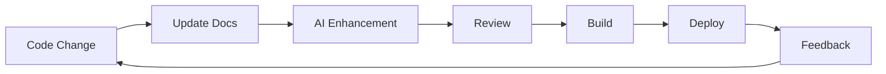

# Meta-Documentation Strategy

## Overview

This document outlines our strategy for using the MkDocs AI Assistant to document itself - a meta-documentation approach that serves as both product documentation and proof of concept.

## Philosophy

### Why Meta-Documentation?

**Dogfooding**: We use our own tool to create our documentation, validating its capabilities and identifying issues before users encounter them.

**Living Example**: Our documentation serves as a comprehensive, real-world example of what the tool can do.

**Continuous Validation**: Every documentation update tests the tool's capabilities, ensuring quality.

**Trust Building**: Well-documented tools built with themselves demonstrate confidence and capability.

**Feedback Loop**: Using our tool daily provides immediate feedback for improvements.

---

## Strategy Components

### 1. Source Material Utilization

**Principle**: Leverage all existing project artifacts as documentation sources.

#### Available Sources

| Source Type | Files | Usage |
|------------|-------|-------|
| **Code** | `*.py` files | API reference, architecture docs |
| **Configuration** | `pyproject.toml`, `mkdocs.yml` | Installation, setup guides |
| **Existing Docs** | `*.md` files | Core documentation content |
| **Templates** | `*.j2` files | Template examples, reference |
| **Examples** | `*.yaml` files | Context examples, use cases |
| **Conversation** | Session history | Use cases, requirements, decisions |

#### Extraction Strategy

```bash
# Extract API documentation from code
mkdocs-ai generate \
  --prompt "Generate API reference from this Python module:
$(cat mkdocs_ai/plugin.py)

Include:
- Class and method signatures
- Parameter descriptions
- Return types
- Usage examples
- Integration points" \
  --output docs/reference/plugin-api.md

# Extract configuration from pyproject.toml
mkdocs-ai generate \
  --prompt "Create installation guide from:
$(cat pyproject.toml)

Include:
- Prerequisites
- Installation methods
- Dependencies explanation
- Verification steps" \
  --output docs/getting-started/installation.md
```

### 2. Template-Based Generation

**Principle**: Use our own templates to generate example documentation.

#### Template Showcase Strategy

Each template becomes both:
1. **Tool for users**: Reusable template for their docs
2. **Example documentation**: Generated example in our docs

```bash
# Generate example using homelab template
mkdocs-ai generate \
  --template templates/homelab-service.md.j2 \
  --context examples/homelab-plex.yaml \
  --output docs/examples/homelab/plex.md

# This creates:
# - Working example for users
# - Validates template functionality
# - Demonstrates template capabilities
```

#### Template Documentation Pattern

For each template:
1. **Template file**: The actual `.j2` template
2. **Context example**: Sample `.yaml` context file
3. **Generated example**: Output documentation
4. **Template guide**: How to use and customize

### 3. AI-Enhanced Sections

**Principle**: Use AI-GENERATE comments for dynamic, context-aware content.

#### Strategic AI Generation

Use AI generation for:
- **Summaries**: Auto-generate section summaries
- **Examples**: Create contextual examples
- **Troubleshooting**: Generate common issues and solutions
- **Comparisons**: Create comparison tables
- **Explanations**: Expand on complex topics

```markdown
## Common Issues

<!-- AI-GENERATE:
List 5 common issues users might encounter when setting up MkDocs AI Assistant:
- Installation problems
- Configuration errors
- API key issues
- Cache problems
- Build failures

For each issue include:
- Symptoms
- Root cause
- Solution with commands
- Prevention tips
-->
```

#### AI Generation Guidelines

**When to use AI-GENERATE**:
- ✅ Repetitive content (troubleshooting, FAQs)
- ✅ Examples and use cases
- ✅ Summaries and overviews
- ✅ Comparisons and tables
- ✅ Explanatory content

**When NOT to use AI-GENERATE**:
- ❌ Critical technical specifications
- ❌ Code examples (use actual code)
- ❌ Version-specific information
- ❌ Legal or licensing content
- ❌ Contact information

### 4. Continuous Documentation

**Principle**: Documentation evolves with the codebase.

#### Documentation Workflow



#### Integration Points

**Pre-commit Hook**:
```bash
# Check for missing documentation
for file in $(git diff --cached --name-only | grep '\.py$'); do
  doc_file="docs/reference/$(basename $file .py).md"
  if [ ! -f "$doc_file" ]; then
    echo "Missing docs for $file"
    # Optionally auto-generate
  fi
done
```

**CI/CD Pipeline**:
```yaml
# .github/workflows/docs.yml
- name: Generate Documentation
  run: |
    mkdocs-ai generate --prompt "Update API reference" --output docs/reference/api.md
    mkdocs build --strict
```

**Scheduled Updates**:
```bash
# Weekly documentation refresh
0 9 * * 1 /usr/local/bin/refresh-docs.sh
```

### 5. Community Contributions

**Principle**: Enable community to contribute documentation using the tool.

#### Contribution Workflow

1. **Fork repository**
2. **Use tool to generate docs**:
   ```bash
   mkdocs-ai generate \
     --prompt "Document [FEATURE] including usage, examples, and best practices" \
     --output docs/[category]/[feature].md
   ```
3. **Review and refine**
4. **Submit PR**

#### Contribution Templates

Provide templates for common contributions:
- New use case documentation
- Integration pattern
- Example project
- Troubleshooting guide
- FAQ entry

---

## Implementation Phases

### Phase 1: Foundation (Week 1)

**Goal**: Establish core documentation structure.

**Tasks**:
1. ✅ Create site structure plan
2. 📝 Set up mkdocs.yml configuration
3. 📝 Generate home page from README
4. 📝 Create installation guide from pyproject.toml
5. 📝 Set up navigation structure

**Success Criteria**:
- Site builds without errors
- Core pages accessible
- Navigation functional

### Phase 2: Content Generation (Week 2)

**Goal**: Generate comprehensive documentation from existing sources.

**Tasks**:
1. 📝 Extract API reference from code
2. 📝 Generate CLI reference from cli.py
3. 📝 Create configuration guide
4. 📝 Split use cases into categories
5. 📝 Generate examples from templates

**Success Criteria**:
- All major sections have content
- Examples are working and accurate
- Reference documentation is complete

### Phase 3: Enhancement (Week 3)

**Goal**: Enhance documentation with AI-generated content.

**Tasks**:
1. 📝 Add AI-GENERATE comments for dynamic sections
2. 📝 Generate troubleshooting guides
3. 📝 Create FAQ from common questions
4. 📝 Add best practices guides
5. 📝 Generate comparison tables

**Success Criteria**:
- AI-generated sections are accurate
- Content is comprehensive
- Examples are practical

### Phase 4: Polish (Week 4)

**Goal**: Refine and optimize documentation.

**Tasks**:
1. 📝 Review all content for accuracy
2. 📝 Add diagrams and visuals
3. 📝 Optimize for search
4. 📝 Test all examples
5. 📝 Add showcase section

**Success Criteria**:
- Documentation is polished
- All examples work
- Search is effective
- Mobile-friendly

### Phase 5: Launch (Week 5)

**Goal**: Deploy and promote documentation.

**Tasks**:
1. 📝 Deploy to hosting (GitHub Pages/ReadTheDocs)
2. 📝 Set up analytics
3. 📝 Announce to community
4. 📝 Gather initial feedback
5. 📝 Create contribution guidelines

**Success Criteria**:
- Site is live and accessible
- Analytics tracking
- Community engagement started
- Feedback mechanism in place

---

## Content Generation Patterns

### Pattern 1: Code-to-Docs

**Use Case**: Generate documentation from source code.

**Process**:
```bash
# Extract module documentation
for module in mkdocs_ai/*.py; do
  module_name=$(basename $module .py)
  mkdocs-ai generate \
    --prompt "Document this Python module:
$(cat $module)

Include:
- Module purpose
- Key classes and functions
- Usage examples
- Integration points" \
    --output docs/reference/$module_name.md
done
```

**Benefits**:
- Always in sync with code
- Comprehensive coverage
- Reduces manual effort

### Pattern 2: Template-to-Example

**Use Case**: Generate examples from templates.

**Process**:
```bash
# Generate example for each template
for template in templates/*.j2; do
  template_name=$(basename $template .md.j2)
  context_file="examples/$template_name.yaml"
  
  if [ -f "$context_file" ]; then
    mkdocs-ai generate \
      --template $template \
      --context $context_file \
      --output docs/examples/$template_name.md
  fi
done
```

**Benefits**:
- Validates templates
- Provides working examples
- Demonstrates capabilities

### Pattern 3: Conversation-to-Use-Cases

**Use Case**: Extract use cases from development conversations.

**Process**:
```bash
# Extract use cases from session summary
mkdocs-ai generate \
  --prompt "Extract use cases from this conversation:
$(cat SESSION_SUMMARY.md)

For each use case:
- Problem statement
- Solution approach
- Implementation example
- Benefits" \
  --output docs/use-cases/extracted.md
```

**Benefits**:
- Captures real requirements
- Documents actual usage
- Preserves context

### Pattern 4: Incremental Enhancement

**Use Case**: Gradually enhance existing documentation.

**Process**:
```markdown
# Existing documentation
## Installation

Install using pip:
```bash
pip install mkdocs-ai-assistant
```

<!-- AI-GENERATE:
Add troubleshooting section for common installation issues:
- Python version conflicts
- Dependency errors
- Permission issues
Include solutions for each
-->
```

**Benefits**:
- Non-disruptive updates
- Targeted improvements
- Maintains existing content

### Pattern 5: Cross-Reference Generation

**Use Case**: Generate related content links.

**Process**:
```bash
# Generate related links for each page
mkdocs-ai generate \
  --prompt "For this documentation page:
$(cat docs/features/document-generation.md)

Generate 'Related Topics' section with:
- Related features
- Relevant guides
- Example usage
- Reference documentation
Include brief descriptions and links" \
  --output /tmp/related.md

# Append to original
cat /tmp/related.md >> docs/features/document-generation.md
```

**Benefits**:
- Improved navigation
- Better discoverability
- Enhanced user experience

---

## Quality Assurance

### Validation Strategy

#### 1. Automated Checks

```bash
#!/bin/bash
# validate-docs.sh

# Check for broken links
mkdocs build --strict

# Validate AI-generated content
grep -r "AI-GENERATE" docs/ | while read line; do
  echo "Unprocessed AI-GENERATE comment: $line"
done

# Check for missing sections
required_sections=(
  "docs/getting-started/installation.md"
  "docs/getting-started/quick-start.md"
  "docs/reference/cli-reference.md"
  "docs/reference/api-reference.md"
)

for section in "${required_sections[@]}"; do
  if [ ! -f "$section" ]; then
    echo "Missing required section: $section"
  fi
done
```

#### 2. Manual Review Checklist

- [ ] Technical accuracy verified
- [ ] Examples tested and working
- [ ] Links functional
- [ ] Code blocks have syntax highlighting
- [ ] Images have alt text
- [ ] Consistent formatting
- [ ] Clear navigation
- [ ] Mobile-friendly

#### 3. Community Review

- Open PRs for major documentation changes
- Request reviews from users
- Incorporate feedback
- Iterate based on usage

### Content Quality Metrics

| Metric | Target | Current |
|--------|--------|---------|
| Documentation coverage | 100% of features | 40% |
| Example count | 20+ | 5 |
| Prompt library size | 50+ | 0 |
| Use cases documented | 30+ | 0 |
| FAQ entries | 30+ | 0 |
| Page load time | <2s | TBD |
| Mobile score | >90 | TBD |
| Search effectiveness | >80% | TBD |

---

## Maintenance Strategy

### Regular Updates

#### Daily
- Monitor for issues
- Respond to questions
- Quick fixes

#### Weekly
- Review analytics
- Update FAQ
- Add new examples
- Refresh AI-generated content

#### Monthly
- Comprehensive review
- Update roadmap
- Add new use cases
- Refactor as needed

#### Quarterly
- Major content refresh
- Architecture review
- Community survey
- Strategic planning

### Automation

```bash
# Weekly documentation refresh
#!/bin/bash
# refresh-docs.sh

# Update FAQ from recent issues
mkdocs-ai generate \
  --prompt "Update FAQ based on recent GitHub issues and discussions" \
  --output docs/community/faq.md

# Refresh examples
for template in templates/*.j2; do
  # Regenerate examples
done

# Update metrics
mkdocs-ai generate \
  --prompt "Generate documentation metrics report" \
  --output docs/about/metrics.md

# Build and deploy
mkdocs build
mkdocs gh-deploy
```

---

## Success Metrics

### Documentation Quality

**Completeness**:
- [ ] All implemented features documented
- [ ] All public APIs documented
- [ ] All templates have examples
- [ ] All use cases covered

**Accuracy**:
- [ ] Examples tested and working
- [ ] Code samples verified
- [ ] Links functional
- [ ] Version information current

**Usability**:
- [ ] Clear navigation
- [ ] Effective search
- [ ] Mobile-friendly
- [ ] Fast load times

### User Engagement

**Traffic**:
- Target: 1000+ monthly visitors
- Bounce rate: <40%
- Average session: >3 minutes
- Pages per session: >3

**Community**:
- GitHub stars: >100
- Active discussions
- Community contributions
- User showcase entries

**Feedback**:
- Positive sentiment: >80%
- Issue resolution time: <48 hours
- Documentation requests addressed
- Regular updates

### Tool Validation

**Dogfooding Success**:
- [ ] All docs generated with tool
- [ ] Templates used in production
- [ ] AI-GENERATE comments working
- [ ] No manual workarounds needed

**Quality Indicators**:
- [ ] Docs are comprehensive
- [ ] Examples are practical
- [ ] Content is accurate
- [ ] Maintenance is sustainable

---

## Lessons Learned

### What Works

1. **Template-based generation**: Consistent, reusable, scalable
2. **AI-GENERATE comments**: Flexible, maintainable, powerful
3. **Code extraction**: Always in sync, comprehensive
4. **Real examples**: Practical, trustworthy, valuable

### Challenges

1. **AI accuracy**: Requires review and validation
2. **Context limits**: Large codebases need chunking
3. **Cost management**: API usage can add up
4. **Version sync**: Keeping docs current with code

### Best Practices

1. **Start small**: Begin with core docs, expand gradually
2. **Validate early**: Test examples before publishing
3. **Iterate often**: Regular small updates better than big rewrites
4. **Community input**: Users provide valuable feedback
5. **Automate wisely**: Automate repetitive tasks, review critical content

---

## Future Enhancements

### Short Term (1-3 months)

- [ ] Interactive examples
- [ ] Video tutorials
- [ ] Searchable prompt library
- [ ] Community showcase
- [ ] Multi-language support

### Medium Term (3-6 months)

- [ ] AI-powered search
- [ ] Personalized documentation
- [ ] Interactive tutorials
- [ ] Documentation analytics
- [ ] A/B testing

### Long Term (6-12 months)

- [ ] Self-improving documentation
- [ ] Automated content updates
- [ ] Community-driven content
- [ ] Documentation marketplace
- [ ] Enterprise features

---

## Conclusion

This meta-documentation strategy demonstrates that MkDocs AI Assistant can:

1. **Document itself comprehensively**
2. **Generate high-quality content**
3. **Maintain documentation efficiently**
4. **Scale with the project**
5. **Serve as a real-world example**

By using our tool to document itself, we:
- Validate its capabilities
- Provide a living example
- Build user confidence
- Identify improvements
- Create valuable documentation

This approach transforms documentation from a burden into a showcase of what's possible with AI-assisted documentation generation.

---

## Next Steps

1. **Review this strategy** with team
2. **Begin Phase 1** implementation
3. **Set up automation** for continuous documentation
4. **Establish metrics** tracking
5. **Launch** and gather feedback
6. **Iterate** based on learnings

The meta-documentation journey begins now. Let's build documentation that documents itself.
