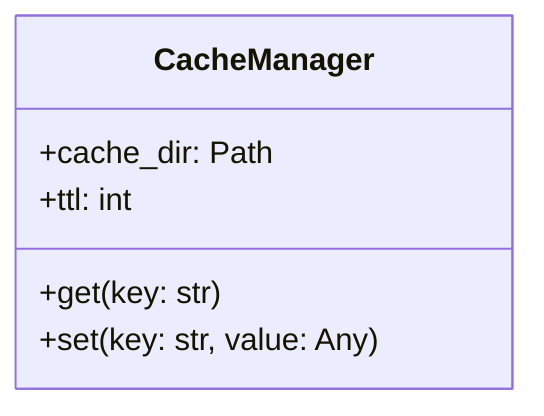
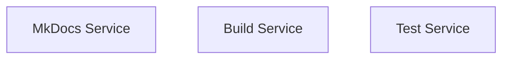

# Asset Processing

Generate documentation from project assets like code, Docker Compose files, and more.

## Overview

Asset processing automatically discovers and documents:

- Python code (with mkdocstrings)
- Docker Compose configurations
- OpenAPI specifications
- Mermaid diagrams

## Features

### Python Code Documentation

Generate API reference with mkdocstrings integration:

```yaml
plugins:
  - mkdocs-ai:
      assets:
        enabled: true
        sources:
          - type: python
            path: mkdocs_ai
            output_dir: docs/api
```

**Output includes:**

- Module overview
- AI-generated summary
- Usage examples
- mkdocstrings API reference
- Class diagrams

### Docker Compose Documentation

Document your Docker services:

```yaml
plugins:
  - mkdocs-ai:
      assets:
        sources:
          - type: docker-compose
            path: docker-compose.yml
            output_dir: docs/infrastructure
```

**Output includes:**

- Service descriptions
- Port mappings
- Volume mounts
- Environment variables
- Architecture diagrams

### Mermaid Diagrams

Generate visual documentation:

- Class diagrams with inheritance
- Architecture diagrams
- Dependency graphs
- Sequence diagrams

## Usage

### CLI Commands

```bash
# Process all configured assets
mkdocs-ai assets process

# Process specific asset type
mkdocs-ai assets process --type python

# Process specific path
mkdocs-ai assets process --path mkdocs_ai/
```

### Auto-Discovery

The plugin automatically discovers:

- Python modules (`.py` files)
- Docker Compose files (`docker-compose.yml`)
- OpenAPI specs (`openapi.yaml`, `swagger.json`)

Excludes:

- Test files
- Hidden files/directories
- `__pycache__`, `.git`, etc.

## Configuration

```yaml
plugins:
  - mkdocs-ai:
      assets:
        enabled: true
        auto_discover: true
        sources:
          - type: python
            path: mkdocs_ai
            output_dir: docs/api
            use_mkdocstrings: true
            ai_summaries: true
            ai_examples: true
          
          - type: docker-compose
            path: docker-compose.yml
            output_dir: docs/infrastructure
            generate_diagrams: true
```

## Python Code Example

**Input:** `mkdocs_ai/cache/manager.py`

**Output:** `docs/api/cache/manager.md`

```markdown
# Cache Manager

AI-generated summary of the cache manager module...

## Usage Example

```python
from mkdocs_ai.cache import CacheManager

cache = CacheManager(cache_dir=".ai-cache")
result = cache.get("my-key")
```

## API Reference

::: mkdocs_ai.cache.manager
    options:
      show_source: true
      members: true

## Class Diagram


```

## Docker Compose Example

**Input:** `docker-compose.yml`

**Output:** `docs/infrastructure/services.md`

```markdown
# Docker Services

## Architecture



## Services

### mkdocs

AI-generated description...

- **Ports**: 8000:8000
- **Volumes**: ./docs:/app/docs
- **Environment**: OPENROUTER_API_KEY
```

## Best Practices

1. **Use mkdocstrings**: Industry standard for Python docs
2. **Enable AI summaries**: Add context to API reference
3. **Generate diagrams**: Visual documentation is clearer
4. **Auto-discover**: Let the plugin find assets
5. **Review output**: AI-generated content may need editing

## Next Steps

- [Document Generation](generation.md) - Create new documentation
- [Content Enhancement](enhancement.md) - Improve existing docs
