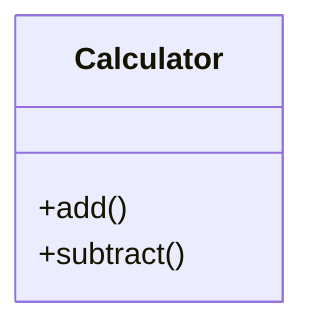
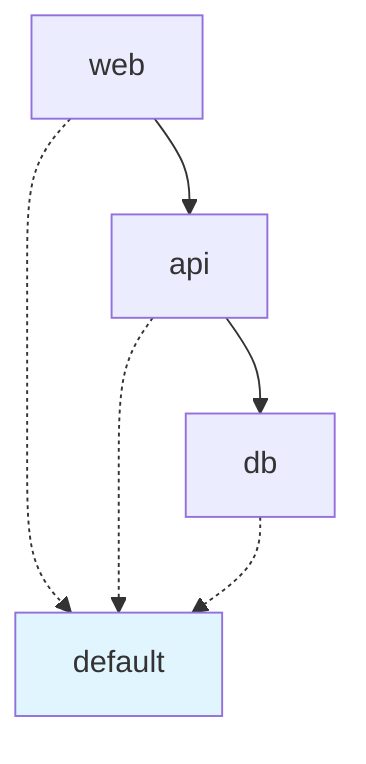

# Asset Processing Example

This example demonstrates how to use the asset processing features in MkDocs AI Assistant.

## Configuration

Add to your `mkdocs.yml`:

```yaml
plugins:
  - ai-assistant:
      provider:
        name: openrouter
        api_key: !ENV OPENROUTER_API_KEY
        model: meta-llama/llama-4-maverick:free
      
      assets:
        enabled: true
        sources:
          # Python code documentation
          - type: python
            path: src/
            output_dir: docs/api
            use_mkdocstrings: true
            ai_summaries: true
            ai_examples: true
            generate_diagrams: true
          
          # Docker Compose documentation
          - type: docker-compose
            path: docker-compose.yml
            output_dir: docs/infrastructure
            generate_diagrams: true
  
  # mkdocstrings for API documentation
  - mkdocstrings:
      handlers:
        python:
          options:
            show_source: true
            show_root_heading: true
            members_order: source
  
  # Mermaid for diagrams
  - mermaid2

markdown_extensions:
  - pymdownx.superfences:
      custom_fences:
        - name: mermaid
          class: mermaid
          format: !!python/name:pymdownx.superfences.fence_code_format
```

## Python Code Documentation

### Automatic Discovery

The asset processor automatically discovers Python modules:

```bash
# Discover all Python modules
mkdocs-ai assets discover --type python

# Output:
# Discovered: src/mypackage/__init__.py
# Discovered: src/mypackage/module.py
# Discovered: src/mypackage/utils.py
```

### Generate Documentation

```bash
# Process all Python modules
mkdocs-ai assets process --type python

# Process specific module
mkdocs-ai assets process src/mypackage/module.py

# With options
mkdocs-ai assets process \
  --type python \
  --output docs/api \
  --diagrams \
  --examples
```

### Example Output

For a Python module like:

```python
# src/mypackage/calculator.py
"""Calculator module for basic arithmetic operations."""

class Calculator:
    """A simple calculator class."""
    
    def add(self, a: int, b: int) -> int:
        """Add two numbers."""
        return a + b
    
    def subtract(self, a: int, b: int) -> int:
        """Subtract b from a."""
        return a - b
```

The processor generates:

````markdown
# mypackage.calculator

## Overview

This module provides basic arithmetic operations through the Calculator class.

**Key Features**:
- Addition and subtraction operations
- Type-safe with type hints
- Simple and intuitive API

**When to use**: When you need basic arithmetic operations in your application.

## Examples

### Basic Usage

```python
from mypackage.calculator import Calculator

calc = Calculator()
result = calc.add(5, 3)
print(result)  # Output: 8
```

### Common Use Case

```python
# Using calculator in a function
def calculate_total(prices):
    calc = Calculator()
    total = 0
    for price in prices:
        total = calc.add(total, price)
    return total
```

## API Reference

::: mypackage.calculator
    options:
      show_source: true
      show_root_heading: true
      members_order: source
````

Plus a class diagram:



## Docker Compose Documentation

### Automatic Discovery

```bash
# Discover Docker Compose files
mkdocs-ai assets discover --type docker-compose

# Output:
# Discovered: docker-compose.yml
# Discovered: docker-compose.prod.yml
```

### Generate Documentation

```bash
# Process Docker Compose file
mkdocs-ai assets process docker-compose.yml

# With AI enhancement
mkdocs-ai assets process docker-compose.yml \
  --ai-summaries \
  --diagrams
```

### Example Output

For a Docker Compose file like:

```yaml
# docker-compose.yml
version: '3.8'
services:
  web:
    image: nginx:latest
    ports:
      - "80:80"
    depends_on:
      - api
  
  api:
    image: python:3.11
    ports:
      - "8000:8000"
    depends_on:
      - db
  
  db:
    image: postgres:15
    environment:
      POSTGRES_PASSWORD: secret
```

The processor generates:

````markdown
# Docker Compose: docker-compose

## Overview

This Docker Compose setup provides a complete web application stack with:
- **Web Server**: Nginx for serving static content
- **API Server**: Python application backend
- **Database**: PostgreSQL for data persistence

## Architecture



## Services

### web

**Image**: `nginx:latest`

**Ports**:
- `80:80`

**Depends on**:
- `api`

### api

**Image**: `python:3.11`

**Ports**:
- `8000:8000`

**Depends on**:
- `db`

### db

**Image**: `postgres:15`

**Environment**:
- `POSTGRES_PASSWORD=secret`

## How to Use

### Start the Stack

```bash
docker-compose up -d
```

### Stop the Stack

```bash
docker-compose down
```

### View Logs

```bash
docker-compose logs -f
```

## Troubleshooting

### Port Conflicts

If port 80 is already in use, modify the web service:

```yaml
ports:
  - "8080:80"
```

### Database Connection Issues

Ensure the database is fully started before the API:

```yaml
api:
  depends_on:
    db:
      condition: service_healthy
```
````

## CLI Commands

### Discovery

```bash
# Discover all assets
mkdocs-ai assets discover

# Discover specific type
mkdocs-ai assets discover --type python
mkdocs-ai assets discover --type docker-compose

# Show detailed information
mkdocs-ai assets discover --verbose

# Save to file
mkdocs-ai assets discover --output assets.json
```

### Processing

```bash
# Process all discovered assets
mkdocs-ai assets process

# Process specific asset
mkdocs-ai assets process src/mymodule.py

# Process with options
mkdocs-ai assets process \
  --type python \
  --output docs/api \
  --use-mkdocstrings \
  --ai-summaries \
  --ai-examples \
  --diagrams

# Batch processing
mkdocs-ai assets process \
  --type python \
  --path src/ \
  --recursive
```

### Statistics

```bash
# Show asset statistics
mkdocs-ai assets stats

# Output:
# Asset Statistics
# ----------------
# Python modules: 15
# Docker Compose files: 2
# OpenAPI specs: 1
# Total: 18
```

## Integration with MkDocs Build

Assets are automatically processed during `mkdocs build`:

```bash
# Build with asset processing
mkdocs build

# Output:
# INFO - Building documentation...
# INFO - Processing assets...
# INFO - Discovered 15 Python modules
# INFO - Discovered 2 Docker Compose files
# INFO - Generated documentation for 17 assets
# INFO - Documentation built in 12.3 seconds
```

## Advanced Usage

### Custom Templates

Create custom templates for asset documentation:

```jinja2
{# templates/python-module.md.j2 #}
# {{ module_name }}

{{ ai_summary }}

## Quick Start

{{ ai_examples }}

## API Reference

{{ mkdocstrings_ref }}

## Diagrams

{{ class_diagram }}
```

Use in configuration:

```yaml
assets:
  sources:
    - type: python
      template: templates/python-module.md.j2
```

### Filtering

Process only specific files:

```yaml
assets:
  sources:
    - type: python
      path: src/
      pattern: "**/*_api.py"  # Only API modules
```

### Custom Processors

Create custom asset processors:

```python
from mkdocs_ai.assets import AssetProcessor

class CustomProcessor(AssetProcessor):
    async def process(self, asset):
        # Custom processing logic
        pass
```

## Best Practices

1. **Use mkdocstrings for Python**: Industry standard, well-maintained
2. **Enable AI summaries**: Helps users understand modules quickly
3. **Generate diagrams**: Visual documentation is more accessible
4. **Cache aggressively**: Asset processing can be slow
5. **Organize output**: Use clear directory structure

## Troubleshooting

### mkdocstrings Not Found

Install the plugin:

```bash
pip install 'mkdocstrings[python]'
```

### Diagrams Not Rendering

Install Mermaid plugin:

```bash
pip install mkdocs-mermaid2-plugin
```

Add to `mkdocs.yml`:

```yaml
plugins:
  - mermaid2
```

### Slow Processing

Enable caching:

```yaml
cache:
  enabled: true
  dir: .ai-cache
```

### API Key Issues

Set environment variable:

```bash
export OPENROUTER_API_KEY=your-key-here
```

## Next Steps

- Explore [Python code examples](python-code-example.md)
- Learn about [Docker Compose processing](docker-compose-example.md)
- Read the [Asset Processing Guide](../PRIORITY_4_ENHANCED_PLAN.md)

---

**Last Updated**: October 17, 2025
